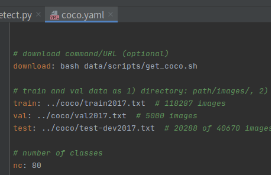

[toc]
- 第一步先检查数据`check_label.py`
- 第一步执行`split_txt.py`划分数据集
- 第二部执行`train_val.py`准备数据集

---

## 数据集制作
官网数据集结构

我们可以看下官方给出的训练数据的传入方式，有两种，如图，第一种直接将训练文件的路径写入txt文件传入。第二种直接传入训练文件所在文件夹。

第一种：



第二种:


这里我们按照第二种建立数据集，官网提供了数据集的tree:


也就是下面的树状结构：
yolo数据格式
```
new
├── images
│   ├── train
│   └── val
└── labels
    ├── train
    └── val
```

## 训练数据集制作
其目录结构如下：（剩下的文件架构代码生成）
```
├── Annotations
├── JPEGImages
├── new
│   ├── images
│   └── labels
├── check_label.py
├── split_txt.py
├── train_val.py
```
其中`JPEGImages`文件夹下放置所有图片，`Annotations`文件夹下放置所有与之对应的xml文件。

split_text.py文件是用来划分数据集使用，内容如下：
```python
# 划分数据集

import os
import shutil
import random

train_val_percent = 0.1
train_percent = 0.9
BASE_DIR = "base"  # 基础目录
xml_path = 'Annotations'  # 标注文件
txt_save_path = 'ImageSets'  # 划分后的标注文件保存位置

base_txt_save_path = '%s/%s/' % (BASE_DIR, txt_save_path)

total_xml = os.listdir(xml_path)
num = len(total_xml)
xml_list = range(num)
tv = int(num * train_val_percent)  # 校验集数量
tr = int(tv * train_percent)  # 测试集数量
random_train_val = random.sample(xml_list, tv)  # 从所有list中返回tv个数量的项目
train_test = random.sample(random_train_val, tr)  # 测试

print("total xml num: %d, train: %d, train test: %d, train val: %d\n" % (num, num - tv, tr, tv))

if not os.path.exists(base_txt_save_path):
    os.makedirs(base_txt_save_path)
else:
    shutil.rmtree(base_txt_save_path)
    os.makedirs(base_txt_save_path)

ftrainval = open('%s/trainval.txt' % base_txt_save_path, 'w')
ftest = open('%s/test.txt' % base_txt_save_path, 'w')  # 测试
ftrain = open('%s/train.txt' % base_txt_save_path, 'w')  # 训练集
fval = open('%s/val.txt' % base_txt_save_path, 'w')  #
for i in xml_list:
    name = total_xml[i][:-4] + '\n'
    if i in random_train_val:
        ftrainval.write(name)
        if i in train_test:
            ftest.write(name)
        else:
            fval.write(name)
    else:
        ftrain.write(name)
ftrainval.close()
ftrain.close()
fval.close()
ftest.close()
```

划分完的数据分布为：
```
├── train                  占90%
└── trainval               占10%
    ├── test               占90%*10%
    └── val                占10%*10%
```

运行
```bash
python split_txt.py
```


接着运行train_val.py,该文件一方面将`Annotations`中xml文件转为txt文件存于all_labels文件夹中，另一方面生成训练所需数据存放架构。（这里如果你的数据直接是txt的标签的话将标签转化的功能注释掉即可）代码如下：

**注意修改classes中的类别,如果与实际情况不相符会发现txt文件里面没有数据**

```python
import xml.etree.ElementTree as ET
import pickle
import os
import shutil
import shutil
from os import listdir, getcwd
from os.path import join

sets = ['train', 'trainval']
classes = ['wildfires', 'car', 'truck', 'excavator', 'tower_crane', 'crane']  # 注意修改

BASE_DIR = "base"  # 基础目录
IMAGE_SETS = "%s/ImageSets" % BASE_DIR  # 存放划分训练集和测试集目录
IMAGE_PATH = "JPEGImages"  # 转换yolov5前图片存放位置
ANNOTATIONS_PATH = "Annotations"  # 转换yolov5前标注文件位置
LABELS_PATH = "%s/all_labels" % BASE_DIR  # 转换yolov5标注后存放位置

DATASETS_NAME = "new"  # 数据集名称


def convert(size, box):
    """
    Args:
        size: list(w,h) 图像宽和高
        box: (xmin, xmax, ymin, ymax)

    Returns:
        返回 x, y, w, h
    """
    dw = 1. / size[0]
    dh = 1. / size[1]
    x = (box[0] + box[1]) / 2.0
    y = (box[2] + box[3]) / 2.0
    w = box[1] - box[0]
    h = box[3] - box[2]
    x = x * dw
    w = w * dw
    y = y * dh
    h = h * dh
    return (x, y, w, h)


def convert_annotation(image_id):
    """
    Args:
        image_id:  图片文件名

    Returns:
        bool: 转换标注成功就返回True否者就返回False(大多数情况是w和h为空)
    """
    with open('%s/%s.xml' % (ANNOTATIONS_PATH, image_id)) as in_file:  # 原标注文件
        tree = ET.parse(in_file)
        root = tree.getroot()
        size = root.find('size')  # 获取图像宽高
        w = int(size.find('width').text)
        h = int(size.find('height').text)
        # 判断w和h是否为0
        if w == 0 or h == 0:
            return False
        obj_list = root.iter('object')
        if len(list(obj_list)) == 0:
            print("%s 没有object" % image_id)
            return False
        for obj in root.iter('object'):
            difficult = obj.find('difficult')
            if difficult is not None:
                if int(difficult.text) == 1:
                    continue

            cls = obj.find('name').text
            if cls not in classes:
                continue
            cls_id = classes.index(cls)
            xmlbox = obj.find('bndbox')
            b = (float(xmlbox.find('xmin').text), float(xmlbox.find('xmax').text), float(xmlbox.find('ymin').text),
                 float(xmlbox.find('ymax').text))
            bb = convert((w, h), b)

            with open('%s/%s.txt' % (LABELS_PATH, image_id), 'w') as out_file:
                out_file.write(str(cls_id) + " " + " ".join([str(a) for a in bb]) + '\n')
                return True
    return False


def prepare_dataset():
    need_delete = list()  # 需要删除的文件

    wd = getcwd()
    print(wd)
    for image_set in sets:
        if not os.path.exists('%s/' % LABELS_PATH):
            os.makedirs('%s/' % LABELS_PATH)
        image_ids = open('%s/%s.txt' % (IMAGE_SETS, image_set)).read().strip().split()
        image_list_file = open('%s/images_%s.txt' % (BASE_DIR, image_set), 'w')
        labels_list_file = open('%s/labels_%s.txt' % (BASE_DIR, image_set), 'w')

        for image_id in image_ids:
            ok = convert_annotation(image_id)  # 如果标签已经是txt格式，将此行注释掉，所有的txt存放到all_labels文件夹。
            if not ok:
                # 将图片从image_ids中删除
                need_delete.append(image_id)
                continue
            image_list_file.write('%s.jpg\n' % (image_id))
            labels_list_file.write('%s.txt\n' % (image_id))
        print("%s 有效图片数量: %d, 无效图片数量: %d\n" % (
            image_set, len(image_ids) - len(need_delete), len(need_delete)))
        print("%s 需要删除的图片:%s \n" % (image_set, need_delete))
        need_delete = list()
        image_list_file.close()
        labels_list_file.close()


def copy_file(new_path, path_txt, search_path):
    '''
    Args:
        new_path: 参数1：存放新文件的位置
        path_txt: 参数2：为上一步建立好的train,val训练数据的路径txt文件
        search_path: 参数3：为搜索的文件位置

    Returns:

    '''
    if not os.path.exists(new_path):
        os.makedirs(new_path)
    with open(path_txt, 'r') as lines:
        filenames_to_copy = set(line.rstrip() for line in lines)
        # print('filenames_to_copy:', filenames_to_copy)
        print(len(filenames_to_copy))
    for root, _, filenames in os.walk(search_path):
        # print('root',root)
        # print(_)
        # print(filenames)
        for filename in filenames:
            if filename in filenames_to_copy:
                shutil.copy(os.path.join(root, filename), new_path)


def clear_data():
    if os.path.exists(LABELS_PATH):
        shutil.rmtree(LABELS_PATH)

    if os.path.exists(DATASETS_NAME):
        shutil.rmtree(DATASETS_NAME)

    if os.path.exists('./%s/images_train.txt' % BASE_DIR):
        os.remove('./%s/images_train.txt' % BASE_DIR)
    if os.path.exists('./%s/images_trainval.txt' % BASE_DIR):
        os.remove('./%s/images_trainval.txt' % BASE_DIR)
    if os.path.exists('./%s/labels_train.txt' % BASE_DIR):
        os.remove('./%s/labels_train.txt' % BASE_DIR)
    if os.path.exists('./%s/labels_trainval.txt' % BASE_DIR):
        os.remove('./%s/labels_trainval.txt' % BASE_DIR)


if __name__ == '__main__':
    clear_data()
    prepare_dataset()

    # 按照划分好的训练文件的路径搜索目标，并将其复制到yolo格式下的新路径
    copy_file('%s/images/train/' % DATASETS_NAME, './%s/images_train.txt' %BASE_DIR, IMAGE_PATH)  # 训练
    copy_file('%s/images/val/' % DATASETS_NAME, './%s/images_trainval.txt' % BASE_DIR, IMAGE_PATH)
    copy_file('%s/labels/train/' % DATASETS_NAME, './%s/labels_train.txt' % BASE_DIR, LABELS_PATH)  # 训练
    copy_file('%s/labels/val/' % DATASETS_NAME, './%s/labels_trainval.txt' % BASE_DIR, LABELS_PATH)

```

将`new`文件夹中的`images`和`labels`拷贝到`datasets`下。

接着按照yolov5-master/data/coco128.yaml文件，制作mycoco.yaml文件(与coco128.yaml文件同目录)：
```yaml
# Default dataset location is next to /yolov5:
#   /parent_folder
#     /mycoco
#     /yolov5


# train and val data as 1) directory: path/images/, 2) file: path/images.txt, or 3) list: [path1/images/, path2/images/]
train: ../mycoco/images/train/  
val: ../mycoco/images/val/  

# number of classes
nc: 7

# class names
names: ['car','chemicals vehicle','truck','bus','triangle warning sign','warning sign','warning slogan' ]
```

[参考](https://blog.csdn.net/weixin_48994268/article/details/115282688)